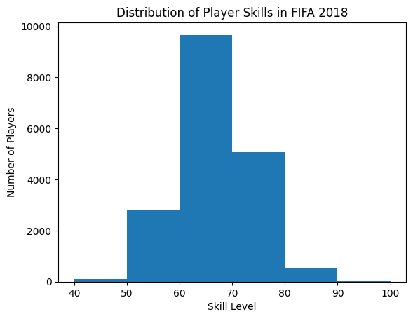

# GitHub Codespaces ♥️ Jupyter Notebooks ♥️

Initial Data Analysis Working on 

Documentation
-------------

```python
import pandas as pd
import numpy as np
import matplotlib.pyplot as plt

gas = pd.read_csv('../data/gas_prices.csv')

plt.figure(figsize=(10,6))

plt.title('Gas Price over Time (in USD)')

plt.plot(gas.Year, gas.USA,'b.-', label='Usa')
plt.plot(gas.Year, gas.Canada, 'r.-', label='Canada')
plt.plot(gas.Year, gas['South Korea'], 'g.-', label='Korea')

plt.xlabel('Year')
plt.ylabel('Us Dollars')

plt.xticks(gas.Year[::2])

plt.legend()

plt.show()
```


<br>
<br>

```python
import pandas as pd
import numpy as np
import matplotlib.pyplot as plt

bins = [40,50,60,70,80,90,100]

plt.hist(fifa.Overall, bins = bins)
plt.xticks(bins)

plt.ylabel('Number of Players')
plt.xlabel('Skill Level')
plt.title('Distribution of Player Skills in FIFA 2018')

plt.show()
```

